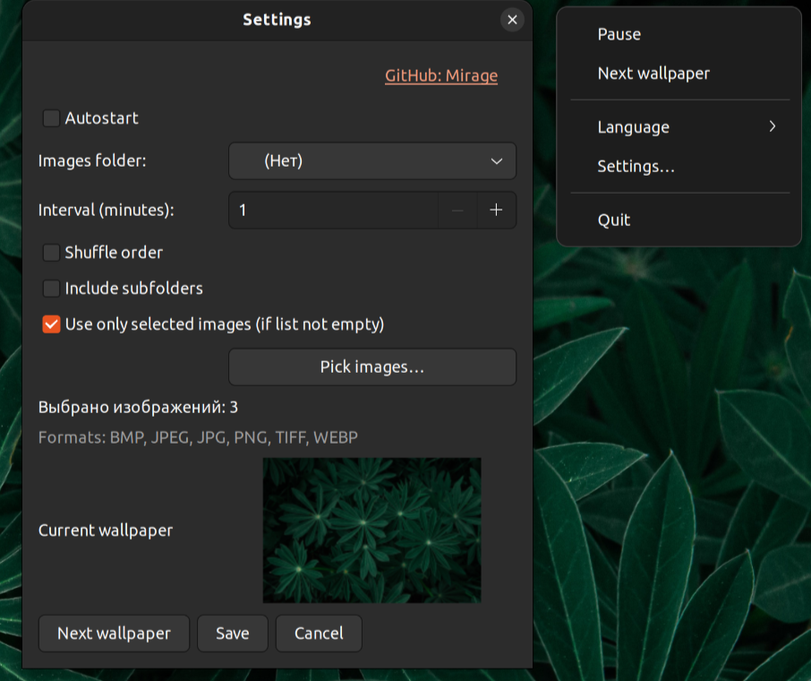

# Mirage

> Lightweight Linux tray app for automatic wallpaper rotation with a modern GTK settings experience.

<p align="center">
  
</p>

## ✨ What’s new in visual style

- Refined dark UI for settings with a gradient hero block.
- Card-based layout with clearer content hierarchy.
- Modern primary/secondary button styles.
- Improved wallpaper preview container.
- Cleaner, more readable project documentation.

## 🚀 Features

- Automatic wallpaper changing from a selected folder.
- Optional recursive scan of subfolders.
- Optional random order (shuffle).
- Manual list mode: rotate only selected images.
- Interval from 1 minute to 24 hours.
- Live preview of current wallpaper in Settings.
- Tray menu controls (pause/resume, next, settings, language, quit).
- Supported formats: **JPG, JPEG, PNG, BMP, TIFF, WEBP**.

## 🌍 Languages

- 🇷🇺 Русский
- 🇬🇧 English

## ⚙️ Configuration

Settings are stored in:

```bash
~/.config/mirage/settings.json
```

Main options:

- `folder`
- `interval_minutes`
- `shuffle`
- `recursive`
- `use_selected_only`
- `selected`
- `language`

## 🧩 Development run

### 1) Install system dependencies (Debian/Ubuntu)

```bash
sudo apt update
sudo apt install python3-gi python3-gi-cairo gir1.2-gtk-3.0 gir1.2-appindicator3-0.1 gir1.2-gio-2.0
```

### 2) Install Python dependencies

```bash
pip install -r requirements.txt
```

### 3) Start app

```bash
python3 app.py
```

## 📦 Build standalone binary (recommended)

```bash
chmod +x build_nuitka.sh
./build_nuitka.sh
```

Check output:

```bash
ls -l *Mirage-onefile
```

## 🧹 Uninstall

```bash
chmod +x uninstall_mirage.sh
./uninstall_mirage.sh --all --purge -y
./uninstall_mirage.sh --all --dry-run
```

## 👤 Author

Made with ❤ by [OlegEgoism](https://github.com/OlegEgoism)

<p align="center">
  
</p>
