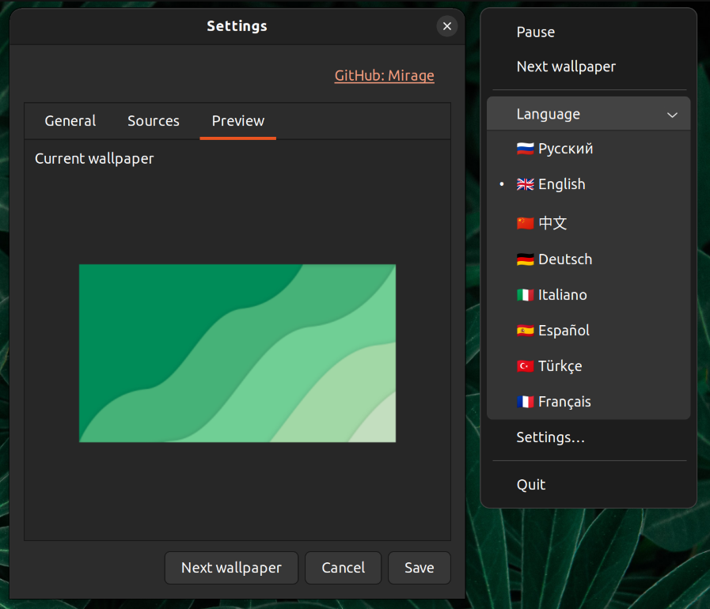

# Mirage


GTK tray application for automatic wallpaper rotation on Linux.

### Features

- Automatic wallpaper rotation by timer.
- Wallpaper source:
    - local folder;
    - manually selected files only;
    - random images via API.
- Modes: shuffle, recursive subfolder scanning.
- Current wallpaper preview.
- Supported formats: JPG, JPEG, PNG, BMP, TIFF, WEBP.
- Runs in system tray.
- Settings UI is split into tabs: General, Sources, Preview.

### Settings location

- `~/.config/mirage/settings.json`

### Run in development mode

1. Install system GTK dependencies (Debian/Ubuntu):

```bash
sudo apt update
sudo apt install python3-gi python3-gi-cairo gir1.2-gtk-3.0 gir1.2-appindicator3-0.1 gir1.2-gio-2.0
```

2. Install Python dependencies:

```bash
pip install -r requirements.txt
```

3. Start app:

```bash
python3 app.py
```

### Build application (Nuitka)

```bash
chmod +x build_nuitka.sh
./build_nuitka.sh
```

Artifacts:

- `Mirage-standalone/` + launcher `./Mirage-run`
- (optional) `Mirage-onefile`

### Build as Python project (wheel/sdist)

```bash
python3 -m pip install --upgrade build
python3 -m build
```

Install locally:

```bash
python3 -m pip install .
mirage
```

## Uninstall

```bash
chmod +x uninstall_mirage.sh
./uninstall_mirage.sh --all --purge -y
./uninstall_mirage.sh --all --dry-run
```

## Contact

- Author: [OlegEgoism](https://github.com/OlegEgoism)
- Repository: <https://github.com/OlegEgoism/Mirage>
- Telegram: [@OlegEgoism](https://t.me/OlegEgoism)
- Email: olegpustovalov220@gmail.com

