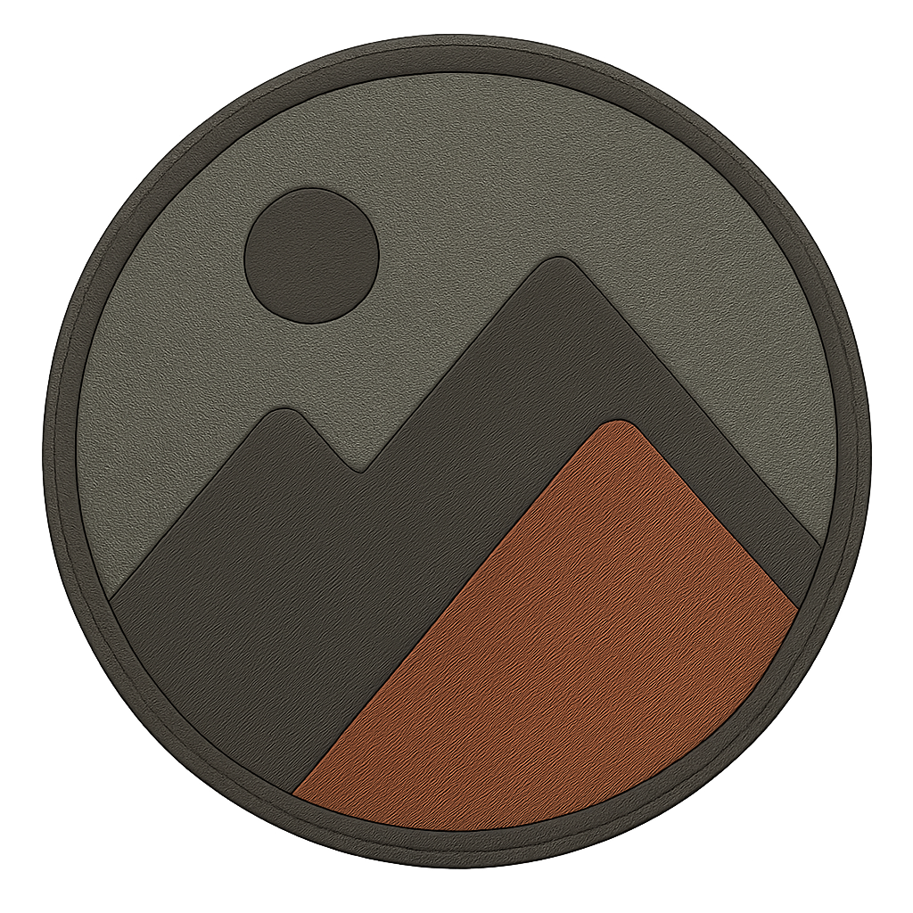
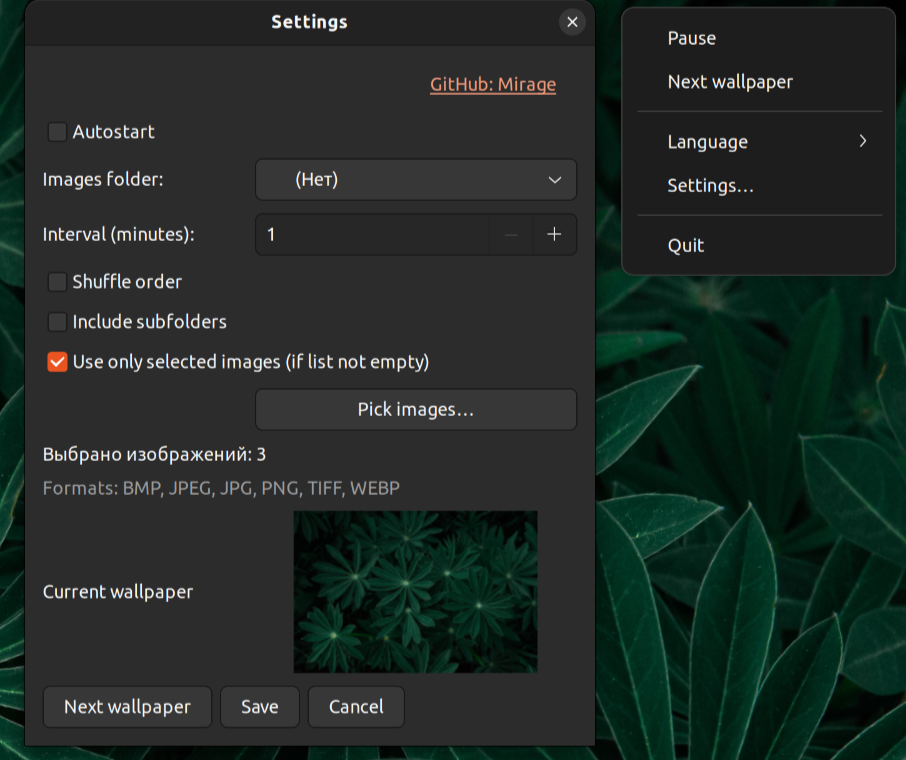

<h1>
"Mirage" Application
</h1>



<h2 style="color: chocolate">
Application Description and Features
</h2> 

Made By ❤ [OlegEgoism](https://github.com/OlegEgoism)

<h3>Main Features</h3>

- Automatic wallpaper changer.
- Select a folder with images for rotation.
- Options: shuffle mode and recursive subfolder scan.
- Ability to use only manually selected images.
- Configurable interval from 1 minute to 24 hours.
- Preview of the currently applied wallpaper.
- Supported formats: JPG, JPEG, PNG, BMP, TIFF, WEBP.
- Minimal resource usage: runs quietly in the system tray.

<h3>Configuration</h3>

- Settings are stored in: ~/.config/mirage/settings.json
- Available parameters:
- Image folder
- Interval (minutes)
- Shuffle on/off
- Recursive mode on/off
- Use only selected images
- Language



<h3>Available Interface Languages</h3>

- 🇷🇺 Russian.
- 🇬🇧 English.

<h2 style="color: chocolate">
Running in Development Mode
</h2>

<h3>💡 apt Installation for Debian/Ubuntu (core libraries)</h3>

```bash
sudo apt update
sudo apt install python3-gi python3-gi-cairo gir1.2-gtk-3.0 gir1.2-appindicator3-0.1 gir1.2-gio-2.0
```

<h3>💡 Install Python dependencies</h3>

```bash
pip install -r requirements.txt
```

<h3>💡 Launching the application</h3>

```bash
python3 app.py
```

<h2 style="color: chocolate">
    Building app
    <span style="color: red">(recommended)</span>
</h2>
<h3>💡 Launch file "build.sh" (assembly time up to 5 minutes)</h3>

```bash
chmod +x build_nuitka.sh
./build_nuitka.sh
```

<h3>💡 Checking the created file Mirage-onefile</h3>

```bash
ls -l *Mirage-onefile
```

<h2 style="color: chocolate">
  Remove
  <span style="color: red">(recommended)</span>
</h2>

```bash
chmod +x uninstall_mirage.sh
./uninstall_mirage.sh [--purge] [--all] [--yes] [--dry-run]
```


